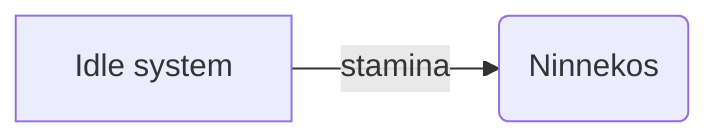
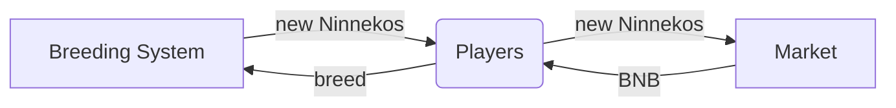

# Play to earn
---

### Stamina

Ninneko has stamina, which recovers every 10 minutes. Battling in PvP Arena costs stamina

### Battling

Using Ninnekos in PvP, player can battle with another and get MATA token as rewards

Once you earn MATA in game, you can claim them to your wallet.

---

### Breeding 

Ninneko can be bred to create new offspring

Players can trade Ninnekos on Market using BNB

