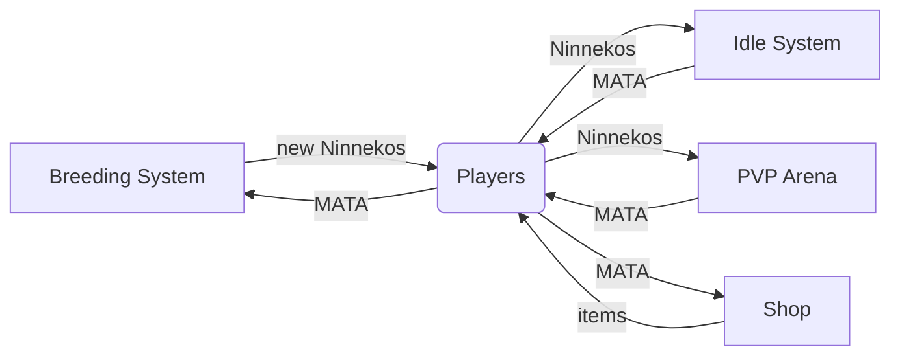

---

Matatabi Token (MATA) is an BEP-20 token which is used as a currency in Ninneko Game.

!!! 
Matatabi has long been known to elicit euphoric response in cats
!!!

---

### An in-game currency

MATA is an uncapped utility token generated by Game System, its supply grows as more players join the game.

Players can spend MATA within the game to breed new Ninneko, purchase multiple items, and earn by playing the game, especially by winning PvP battles.

Upon spending MATA, MATA is burned (permanently removed from the supply). This burning mechanism partially offsets inflation.

Purchasing MATA on the open market is also a way for gamers to get a headstart.

MATA is a token generated by Game System which players can earn playing the game, especially by winning PvP battles.

### Balancing MATA 

The balance between MATA's production and consumption is the prerequisite to the design of the game.

#### Rewards

We will adjust the MATA of in-game rewards based on the ratio of MATA minted vs MATA burned

#### Buy back

2% marketplace fee will be used for buying back (and burn) MATA token. 

#### MATA consumption

Besides breeding, MATA can be used to upgrade Ninneko, having this burning mechanism would increase demand for MATA.

