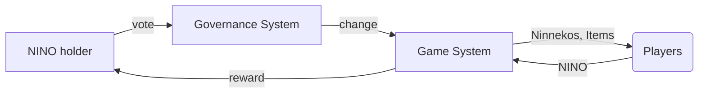

---

Ninneko Token (NINO) is a BEP-20 utility/governance token for the Ninneko Game. 

Contract Address: [0x6CAD12b3618a3C7ef1FEb6C91FdC3251f58c2a90](https://bscscan.com/token/0x6cad12b3618a3c7ef1feb6c91fdc3251f58c2a90)

[Audit report](https://ninneko.com/audit.pdf) by [Verichains](https://www.verichains.io/)

---
### An utility token 

The goal of introducing NINO token is to provide a convenient mode of payment and settlement between participants who interact within the ecosystem of Ninneko Game. Players use NINO Token to pay for Ninneko breeding fee

Whereas MATA has an unlimited supply, NINO is limited to a maximal supply of 200 million. The spent MATA is burned, but NINO is reallocated to the Community Treasury. 

NINO in Community Treasury is used to rewarding players, holders who contribute to build game ecosystem and paying for game development cost

---

### A governance token

To promote decentralised community governance for the game, NINO tokens allow holders to propose and vote on governance proposals to determine features and/or parameters of Ninneko Game.

Users which have participated in submission of proposals, voting will be entitled to receive NINO token governance rewards.

---

